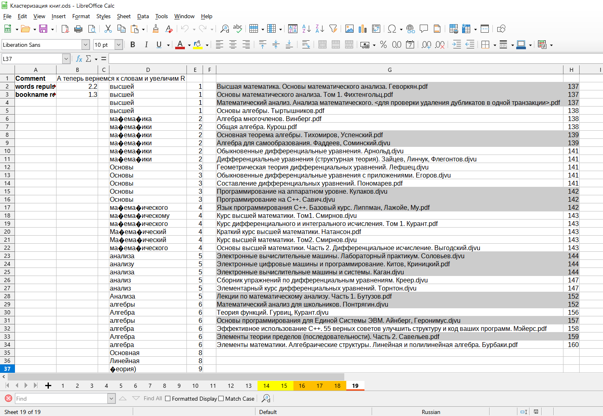

# CLOPEClusteringAlgorithm
Тестовое задание по реализации алгоритма кластеризации категорийных данных CLOPE.

Оригинальная публикация: https://www.researchgate.net/publication/2589850_CLOPE_A_Fast_and_Effective_Clustering_Algorithm_for_Transactional_Data.

Дополнительную информацию можно посмотреть здесь: https://loginom.ru/blog/clope.

## Кластеризация
### Датасет [Грибы](https://github.com/igor-240340/CLOPEClusteringAlgorithm/blob/main/CLOPEClusteringAlgorithm/Data/agaricus-lepiota.data)
Использован классический датасет грибов взятый здесь: https://archive.ics.uci.edu/ml/datasets/mushroom.

### Датасет [Книги](https://github.com/igor-240340/CLOPEClusteringAlgorithm/blob/main/CLOPEClusteringAlgorithm/Data/books.txt)
Посмотреть результаты кластеризации при разных параметрах можно [здесь](docs/Кластеризация%20книг.ods).
> **Замечение**: 
Кириллические названия в выходных файлах и в отчете в таблице имеют кракозябры.
Это результат предобработки датасета слов, в ходе которого происходит удаление определенных символов: запятые, точки и др.
Кириллица в UTF-8 представлена двумя байтам, а предобработка происходит побайтно, поэтому возможна деформация кириллических символов, но на кластеризацию это сейчас не влияет, потому что одинаковые символы в словах мы и "корёжим" одинаково и "близость" слов от это	й деформации не меняется.



Каждая строка входного файла представляет собой название книги:

```
Основы математического анализа. Том 1. Фихтенгольц.pdf
Математический анализ для школьников. Понтрягин.djvu
```

Общая идея кластеризации состоит в том, чтобы представить название книги как транзакцию,
а каждое слово в названии - как элемент транзакции.
Ожидается, что книги, содержащие в названии близкие по смыслу слова, будут сгруппированы вместе.
Реализуется это в несколько этапов.

Удаляем список авторов из названия:
```
Основы математического анализа. Том 1.
Математический анализ для школьников.
```

Разбиваем название на слова, разделенные запятой (угловые скобки здесь для удобства восприятия знаков препинания):
```
<Основы>,<математического>,<анализа.>,<Том>,<1.>
<Математический>,<анализ>,<для>,<школьников.>
```

Очищаем слова от мусорных символов:
```
Основы,математического,анализа,Том
Математический,анализ,для,школьников
```

Очевидно, что книги имеют много общего, но проблема в том, что близкие по смыслу слова ``("Математический","математического")`` и ``("анализ","анализа")`` фактически разные и у нас нет перекрытия по ним.
Задача - всё-таки получить по ним перекрытие.
Была идея просто урезать эти слова, отбрасывая варьирующие части типа окончания, приставки и т.д.
Но также возникла идея применить CLOPE и для слов.

Возьмем получившиеся слова по всем названиям и каждое слово представим как транзакцию, а каждую букву - как элемент транзакции.
тогда слова ``("анализ","анализа")`` в форме транзакций будут выглядеть так:
```
а1,н2,а3,л4,и5,з6
а1,н2,а3,л4,и5,з6,а7
```

Между транзакциями есть явное перекрытие, поэтому при подходящем параметре отталкивания они попадут в один кластер.
> **Замечение**: 
Мы смотрим на слова как на грибы, а на позиции символов - как на атрибуты грибов, а на сами символы в позициях - как на значения атрибутов.
Два совершенно неродственных слова могут быть составлены из одинаковых символов алфавита,
поэтому одинаковые символы в одинаковых позициях должны совпадать.
А те же одинаковые символы, но в разных позициях - различаться.

Допустим, что слова ``("Математический","математического")`` попали в кластер ``c0``, а слова ``("анализ","анализа")`` - в кластер ``c1``.
Остальные слова пускай попадут каждое в свой уникальный кластер.
Теперь заменим в датасете книг каждое слово на номер кластера, в который оно попало на этапе группировки слов:
```
Основы,математического,анализа,Том
Математический,анализ,для,школьников
```
```
c2,(c0),(c1),c3
(c0),(c1),c4,c5
```

Теперь у нас есть перекрытие по похожим словам и мы можем кластеризовать названия книг так же, как мы кластеризовали грибы и слова.

## Юнит-тесты
Нам нужно убедиться, что наш код работает правильно. Мы могли бы найти эталонный датасет и эталонную кластеризацию и сравнить при одинаковых параметрах результаты кластеризации нашей программы и эталонной.
Но вполне возможна ситуация, когда наша реализация будет некорректной, но при этом при определенных параметрах (в данном случае - repulsion) будет давать на выходе ожидаемое распределение по кластерам.
Допустим, что в эталонной (и корректной) реализации помещение транзакции в некий кластер ``c`` даёт прирост целевой функции равный ``10``, который является максимальным.
Допустим также, что в нашей реализации при оценке прироста качества кластера допущена ошибка и вместо ``10`` мы получаем ``9``, но тем не менее, это значение всё-равно оказывается максимальным приростом, поэтому транзакция в итоге окажется в правильном кластере.
Таким образом, ошибки в промежуточных оценках могут не повлиять на конечный результат, поэтому важно проверить корректность работы промежуточных модулей.

## Результаты
Результат интересный. Но неродственные по смыслу слова могут попасть в один кластер, например ``("уровне","уравнение")`` и наоборот.
